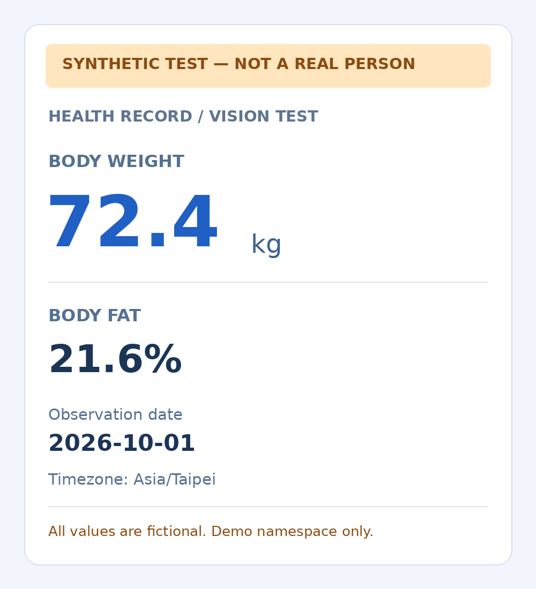

# Image-upload scenarios / 圖片上傳使用情境

The included test card and all scenarios below are synthetic. They contain no
real health records, photos or screenshots. The card is a test input, not evidence
of completed image analysis, saving or model accuracy.
本文所附測試卡與以下情境皆為合成範例，不含真實健康紀錄、照片或截圖。測試卡是輸入
範例，不代表已完成圖片辨識、儲存或驗證模型準確率。

## Current prototype and expected future integration / 現有原型與預期整合

**Current prototype:** the original interactive ChatGPT widget and standalone
Web App/PWA share owner-scoped Cloudflare D1 records. Real mode requires existing
server-side owner authorization; synthetic demo is separate. The embedded widget
can send a selected image only when the active host advertises the necessary
image capability and the user agrees. It checks bounded JPEG date metadata and
redraws real-image pixels to remove hidden metadata. A host accepting a message
does not prove the model saw the image or saved a record. Tests cover model/date
rules, bridge handshakes, chart rendering, idempotency and isolated store behavior;
they do not prove every device, host or image extraction is accurate.

**現有原型：** 原本的 ChatGPT 互動介面與獨立 Web App/PWA 共用本人範圍內的
Cloudflare D1 結構化紀錄。真實資料模式需既有伺服器端本人授權，合成示範另行隔離。
內嵌介面僅在目前主程式宣告圖片能力且使用者同意後傳送本次選取的圖片；會解析有界限
的 JPEG 日期中繼資料，並重繪正式圖片像素以移除隱藏資訊。主程式接受訊息不等於模型
看見圖片，也不等於紀錄已儲存。測試涵蓋資料與日期規則、橋接、圖表、重試及隔離儲存
行為，不能推論所有裝置、主程式或圖片的辨識結果都正確。

**Expected future work, not delivered by this prototype:** standalone automatic
ChatGPT analysis using approved plan-backed access; a shared canonical Library,
Space, Notion or Drive dataset across both frontends. The standalone page currently
provides manual entry and draft review, with guidance to use ChatGPT for photos.
It has no standalone image-upload/automatic-analysis endpoint, background worker
or model API credential. SIWC application review, access approval and actual
capability validation are still needed before claiming that planned flow. Sign-in
alone does not grant inference, connector access or common Library/Space
synchronization.

**預期後續工作，尚非此原型已完成功能：** 使用正式核准的方案存取，在獨立網頁自動
呼叫 ChatGPT 分析；以及兩個前端共用同一個 Library、Space、Notion 或 Drive 正式
資料集。獨立頁面目前提供手動輸入、草稿核對及轉到 ChatGPT 處理照片的說明，沒有獨立
圖片上傳／自動辨識端點、背景工作或模型 API 金鑰。正式 SIWC 申請審查、存取核准與
實際能力驗證仍是預期流程的前提；登入本身不代表取得推論、連接器或共用 Library/Space
同步能力。

## Language behavior / 語言行為

Choose **Auto / 自動**, **繁體中文**, or **English** in either frontend and the
PWA offline shell. Auto in the standalone app follows supported browser languages.
Embedded Auto prefers the current host's optional BCP 47 locale hint, then browser
languages, then English. MCP Apps `hostContext.locale` and
`ui/notifications/host-context-changed` are used when provided; the ChatGPT
compatibility path reads `window.openai.locale` and `openai:set_globals` locale
updates. These are current environment hints, not access to conversation history
or a permanent user-language profile. No IP, GPS or location inference is used.
Only a manual language preference is stored locally; Auto removes it. Host/browser
changes update Auto, while manual choice wins until reset. Storage restrictions
may limit a manual preference to the current view. Language choices can persist
separately across origins/devices; no account-wide language sync is promised.

兩個前端與 PWA 離線頁皆可選 **自動、繁體中文、English**。獨立網頁的自動模式依支援
的瀏覽器語言；內嵌介面優先採目前主程式提供的可選 BCP 47 語言提示，再依瀏覽器語言，
最後回退英文。支援主程式提供的 MCP Apps `hostContext.locale` 與
`ui/notifications/host-context-changed`，並相容 ChatGPT `window.openai.locale`
及 `openai:set_globals` 更新。這是當前環境提示，並非讀取歷史對話或永久語言設定；
不依 IP、GPS 或所在地猜語言。本機只保存手動語言偏好，選自動時移除。自動隨主程式／
瀏覽器更新，手動選擇優先直到重設。若儲存受限，手動偏好可能僅在本次介面有效；不同
來源網域與裝置不保證共用偏好，也不宣稱帳號層級同步。

`zh-Hant`, `zh-TW`, `zh-HK`, `zh-MO` and unspecified `zh` use Traditional Chinese;
English regional tags use English. Explicit `zh-Hans`/Chinese mainland or Singapore
without a Hant script use the next supported browser language, then English.
Simplified Chinese is not claimed as a translation. Locale changes format labels,
dates, numbers and known synthetic demo labels only. Original notes, exercise
names, values, machine IDs, consent, timestamps and date evidence are preserved.

繁體中文涵蓋上述 Hant／地區代碼及未指定地區的 `zh`；英文地區代碼使用英文。明確 Hans
或未指定 Hant 的中國／新加坡語言提示會回退下一個支援的瀏覽器語言，再回退英文，
不宣稱已有簡體翻譯。切換只改介面、日期／數字格式與已知合成示範文字的顯示；不改寫
原始備註、動作名稱、健康數值、機器 ID、授權、時間戳或日期證據。

## 1. Embedded scale image / 內嵌體脂計圖片

*Previously generated synthetic scale test card, reproduced unchanged. All values
are fictional and intended only for the demo namespace. This is not a real scale
photo or evidence that an image-analysis workflow has succeeded.*

*先前產生的合成體脂計測試卡，原圖未經修改。所有數值均為虛構，僅供合成示範空間使用；
這不是真實體脂計照片，也不是圖片辨識流程已成功的證據。*

1. In the synthetic demo space, choose the synthetic scale test card above showing
   **72.4 kg, 21.6% body fat**. Select only that image and consent to send it to
   ChatGPT. Demo-draft creation is a separate opt-in; analysis-only sends no write
   authorization. No real photo is included in this repository.
2. The host must declare a usable image route. Otherwise stop and explain the
   limitation; never pretend text-only transport analyzed an image. The user may
   separately attach a photo in the conversation, with the same uncertainty rules.
3. Extract only visible fields. A synthetic visible measurement date such as
   **2026-10-01** can be reviewed. Available EXIF is evidence of capture, not always
   measurement. Missing/conflicting dates, time zones or kg/lb stay unresolved;
   ask the user rather than inserting today, upload time or a location-based zone.
4. Review values and destination. For real data, the prototype uses the already
   authorized owner-private D1 space; it does not silently choose a connected
   store. A planned user-owned destination requires explicit approval of its
   exact identity, categories and purpose before health-data transmission.
5. Only a successful save-tool result confirms saving. Re-read the saved record;
   show it in the full report and the active-record trend. Unclear results remain
   uncertain. Original image/GPS are not stored on the website.

1. 在合成示範空間選用上述 **72.4 公斤、體脂 21.6%** 的合成測試卡，只選本次圖片
   並同意送給 ChatGPT。允許建立合成草稿另行勾選；只辨識模式不授權寫入。此儲存庫
   不附真實照片。
2. 主程式須宣告可用圖片通道，否則停止並說明限制，不能把純文字傳送當作已辨識圖片。
   使用者可另行在對話附圖，但仍須遵守相同不確定資訊規則。
3. 只擷取看得見的欄位。畫面合成日期例如 **2026-10-01** 可供核對；EXIF 僅是拍攝
   證據，不一定是量測時間。日期、時區、公斤／磅缺漏或矛盾時維持未確認並詢問，不能
   使用今天、上傳時間或依所在地猜時區。
4. 核對數值與目的地。現有真實資料原型使用已授權的本人 D1 空間，不自動選連接器儲存。
   預期的使用者自有目的地須先確認確切位置、資料類別與用途，才傳送健康資料。
5. 僅儲存工具成功結果可表示已儲存，再讀回該筆資料，於完整報表及有效紀錄趨勢顯示。
   不明結果仍標示不明；網站不保存原圖或 GPS。

## 2. Embedded workout screenshot / 內嵌訓練截圖

Use a fabricated screenshot specification: **Squat, 60 kg, 8 repetitions × 3
sets**, measurement date **2026-10-02**. Treat each exercise as a separate record
with a stable image-source ID plus fixed observation index. If the screenshot
shows `60` without kg/lb, retain a pending draft and ask about the unit. Screenshot
capture EXIF does not establish when the workout occurred. The user's exercise
name and notes remain original text even when the interface changes language.
After clarification and authorized confirmation, compare loads only for the same
exercise. The dashboard displays its existing kg-normalized weight/load charts;
it does not infer training recommendations.

使用虛構截圖規格：**深蹲、60 公斤、每組 8 次 × 3 組**，量測日期 **2026-10-02**。
每個動作是一筆獨立紀錄，使用穩定圖片來源 ID 加固定欄位序號。若截圖只有 `60` 而無
公斤／磅，保留待釐清草稿並詢問單位；截圖拍攝 EXIF 不能證明訓練日期。切換語言仍保留
使用者原始動作名稱與備註。釐清並授權確認後，僅比較同一動作負重。現有圖表維持以公斤
正規化顯示體重／負重，不推論訓練建議。

## 3. Standalone Web App/PWA upload intent / 獨立網頁／PWA 上傳意圖

**Today:** open the existing website or installed PWA, choose Auto/English/繁體中文,
and use Add record to enter the same synthetic scale/workout values manually.
Create a draft, inspect the actual date/time zone/unit, update it if needed and
confirm saving. To analyze an image, use the guided ChatGPT route; the standalone
page does not silently upload or analyze a selected file. Installed PWA behavior
is the same and requires a connection for records. Offline it shows a localized
generic shell; it caches no authenticated pages, health responses or images.

**Expected after official access and validation:** a standalone image picker
would show the exact destination and intended image-analysis recipient, obtain
explicit approval, then invoke a supported plan-backed analysis route. Review
unclear dates/units before save. Re-read the same canonical dataset in both
frontends before claiming common synchronization. If access or writable storage
is unavailable, provide manual review/export and state the blocker. No operator
model-API bill, invented connector call or hidden fallback is promised by this
scenario. This expected branch is not implemented in the current Web App/PWA.

**目前：** 開啟既有網站或已安裝 PWA，選自動／英文／繁體中文，以新增紀錄手動填入
同樣的合成體重／訓練值；建立草稿，核對日期、時區、單位，必要時更新後確認儲存。
圖片辨識請依說明轉到 ChatGPT；獨立頁面不會偷偷上傳或分析檔案。PWA 同樣需連線讀寫，
離線只顯示對應語言的一般提示，不快取登入頁、健康回應或圖片。

**正式存取核准並驗證後的預期流程：** 獨立圖片選取器先呈現確切目的地、圖片分析接收
對象與用途，取得明確同意後才呼叫支援的方案分析管道；不確定日期／單位先核對。兩個
前端均讀回同一正式資料集後，才表示已共用同步。無分析存取或可寫儲存時提供手動核對／
匯出並說明阻礙，不承諾營運者模型 API 費用、虛構連接器或隱藏替代傳送。此預期分支
尚未在目前 Web App/PWA 實作。

## 4. Retry, correction, trends, read-only and cancel / 重試、更正、趨勢、只讀與取消

- **Retry / 重試：** after timeout, inspect the conversation/tool result and read
  the affected record before retrying. Reuse the stable request/source key; the
  prototype rejects conflicting content under one request ID and deduplicates
  confirmed entries. A transport acceptance is never a saved confirmation.
  逾時先查看對話／工具結果並讀回受影響紀錄，再用同一穩定請求／來源編號重試；相同
  編號不同內容會拒絕，已確認紀錄會去重。傳送成功不等於儲存成功。
- **Correction / 更正：** update a pending draft through its replacement-draft
  flow with a new request ID, then review and confirm. Do not silently overwrite a
  confirmed record. The current prototype has no direct confirmed-record edit
  button; correction may require an explicitly instructed replacement and
  recoverable deletion of the incorrect original. User-owned-storage correction
  remains a separate proposed integration.
  待確認草稿以新請求編號走取代草稿流程，再核對確認；不能默默覆寫已入帳紀錄。現有
  原型沒有直接編輯已入帳紀錄的按鈕；可能需使用者明確要求另建正確紀錄並把錯誤原筆
  移入可還原回收區。自有儲存更正仍屬另外的預期整合。
- **Trend / 趨勢：** drafts/deleted entries are excluded. A single saved observation
  displays a visible point; later observations form a dated series. Partial
  loaded data is labeled, and loading more does not fabricate missing values.
  草稿與刪除紀錄不計入；單筆顯示明確點位，多筆依日期形成曲線。部分載入資料有提示，
  載入更多不虛構缺值。
- **Read-only / 只讀：** Analyze only allows extraction discussion and no write
  tools. A question about trends or deletion is not permission to import, save,
  delete or restore. Only exact user-requested deletion/restoration is executed.
  只辨識僅展示擷取結果，不呼叫寫入；詢問趨勢或刪除功能不等於授權匯入、儲存、刪除
  或還原，只處理使用者明確指定的筆數／紀錄。
- **Cancel / 取消：** do not choose or consent to an image, or close the review
  dialog before saving. No new analysis/save request is sent. A draft already
  created remains pending; closing does not erase it. Once a message/save request
  has been sent, closing UI cannot promise cancellation—read back its status.
  未選圖／未同意，或儲存前關閉核對視窗，不送新的辨識／入帳請求；已建立草稿仍待確認，
  關閉不會刪掉它。已送出的訊息／儲存請求不能因關閉介面就宣稱取消，須讀回確認狀態。

## Official locale references / 官方語言介面依據

Checked 2026-10-02 / 查核日期：2026-10-02。
[OpenAI component locale and globals](https://developers.openai.com/plugins/reference),
[MCP Apps host locale](https://apps.extensions.modelcontextprotocol.io/api/interfaces/app.McpUiHostContext.html),
[partial host-context updates](https://apps.extensions.modelcontextprotocol.io/api/interfaces/app.McpUiHostContextChangedNotification.html).
These references establish optional hints, not universal host availability.
這些依據僅證明可選提示介面，不代表所有主程式皆提供。
